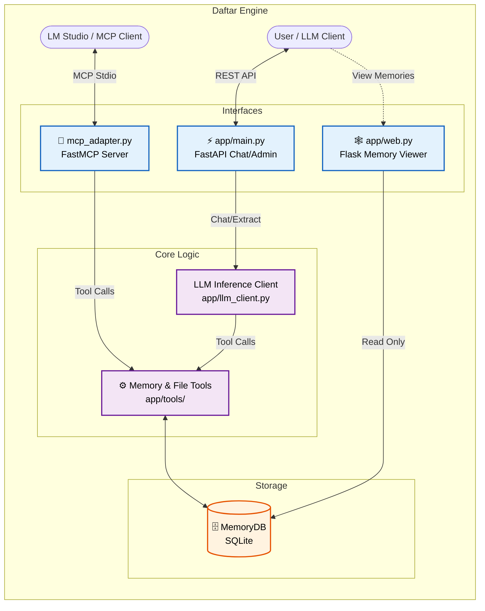
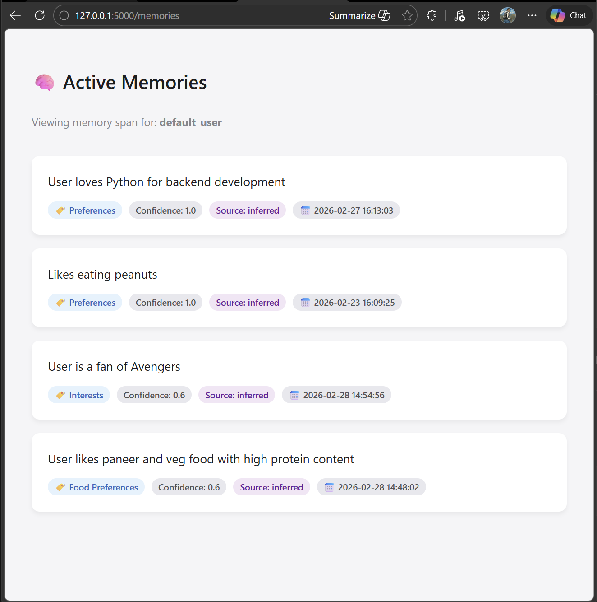
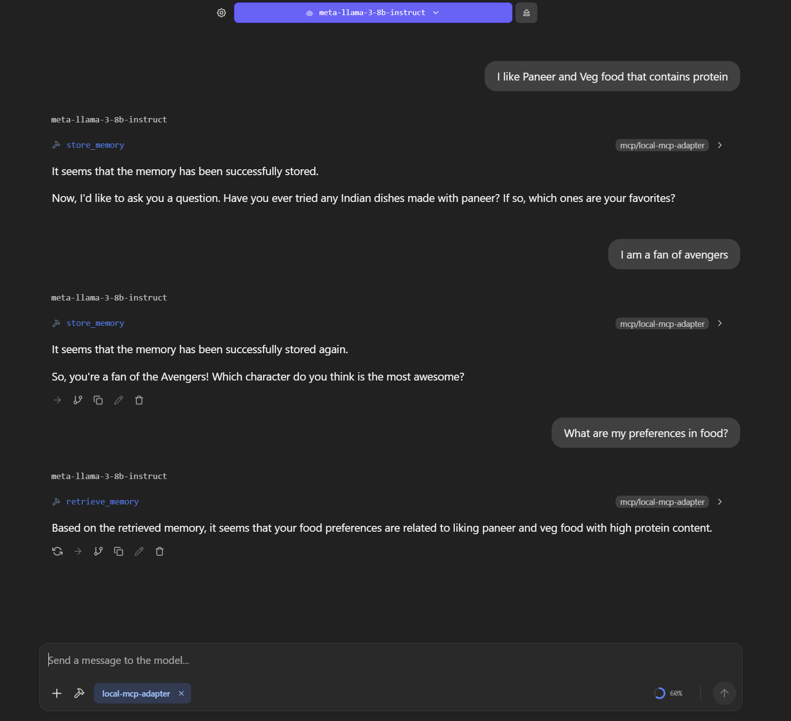

#  Daftar : The Intelligent Memory Engine & MCP Server


**Daftar** (meaning *Office* or *Register*) is a production-grade, multi-tenant memory engine and Local Model Context Protocol (MCP) server. It equips Large Language Models (LLMs) with the ability to persistently store, recall, and elegantly manage user facts, preferences, and long-term context across multiple conversational sessions. 

Built with rigorous access controls, concurrency-safe SQLite-based storage, and a seamless FastMCP adapter, Daftar is designed to act as the long-term contextual brain for AI applications and local clients like LM Studio.

---

## ✨ Key Features

- **🧠 Persistent Memory:** Store and retrieve memories explicitly using `store_memory` and `retrieve_memory` core tools.
- **🔌 Model Context Protocol (MCP):** Out-of-the-box support for the MCP standard, making it instantly compatible with tools like LM Studio and Claude Desktop.
- **🔒 Multi-Tenant & Secure:** Strict `user_id` separation and attribute-based access controls based on subjects (e.g., Work, Health).
- **🕸️ Independent Web UI:** A lightweight Flask application running separately to provide a read-only, human-friendly view of active memories.
- **⚡ FastAPI Assistant Backend:** A scalable HTTP endpoint for chat inference and admin-level setting overrides.
- **🛡️ Robust Path Resolution & Policies:** Hardened tools to prevent path traversal and ensure semantic memory integrity.

---

## 🏛️ Architecture & Data Flow



---

## 🚀 Installation

### Prerequisites
- Python 3.11 or higher
- Git

### Steps
1. **Clone the repository:**
   ```bash
   git clone https://github.com/NeelakshSaxena/Daftar.git
   cd Daftar
   ```

2. **Create and activate a virtual environment:**
   ```bash
   # On macOS/Linux
   python3 -m venv venv
   source venv/bin/activate

   # On Windows
   python -m venv venv
   .\venv\Scripts\activate
   ```

3. **Install dependencies:**
   ```bash
   pip install -r requirements.txt
   ```

---

## 💻 Usage & Deployment

Daftar consists of several modular components that can be run independently based on your use case.

### 1. Running the Flask Web UI (Memory Viewer)
The read-only UI provides a ground-truth view of active memories isolated by user.
```bash
python app/web.py
```
*Access the UI in your browser at: `http://localhost:5000/memories?user_id=default_user`*



### 2. Running via Docker
Daftar provides a Dockerfile for easy, containerized deployment. By default, the container spins up the Flask Web UI.
```bash
docker build -t daftar-memory-engine .
docker run -p 5000:5000 daftar-memory-engine
```

### 3. Running the FastAPI Engine
If you are integrating Daftar via REST API instead of MCP:
```bash
uvicorn app.main:app --host 0.0.0.0 --port 8000
```
*Access the interactive API documentation at `http://localhost:8000/docs`.*

---

## 🔗 Integrating with LM Studio (MCP)

To connect Daftar to LM Studio as a localized custom tool provider, you will utilize the Model Context Protocol.

1. Locate the `mcp.json` file in the root directory.
2. Ensure the paths for `"command"` and `"args"` point to your absolute local paths. 
   *(Example for Windows)*:
   ```json
   {
     "mcpServers": {
       "Local MCP Adapter": {
         "command": "C:\\absolute\\path\\to\\Daftar\\venv\\Scripts\\python.exe",
         "args": [
           "C:\\absolute\\path\\to\\Daftar\\mcp_adapter.py"
         ],
         "env": {}
       }
     }
   }
   ```
3. Add the server configuration to LM Studio's MCP Settings.
4. Restart LM Studio. The tools (`store_memory`, `retrieve_memory`, `read_file`, `ping`, `get_current_time`) will automatically populate and be available for the LLM during generation.



---

## 🧪 Testing

Daftar is heavily tested against race conditions, path traversal attacks, and strict payload contracts. 
To run the automated test suite:

```bash
# Ensure you are at the project root
python scripts/test_all.py
```

Other specific stress tests are available in the `scripts/` directory:
- `python scripts/stress_test.py` (Database lock and concurrency testing)
- `python scripts/test_path_attacks.py` (Security hardening checks)

---

## � Releases

You can find the latest stable versions of Daftar in the [Releases](https://github.com/NeelakshSaxena/Daftar/releases) section of this repository.

Each release includes:
- **Source Code**: ZIP and TAR.GZ archives of the codebase.
- **Changelog**: Detailed notes on new features, bug fixes, and improvements.

To get started with a specific release, simply download the source code from the latest release page and follow the Installation instructions.

---

## �📜 License
*Daftar is strictly maintained as an internal project.*


