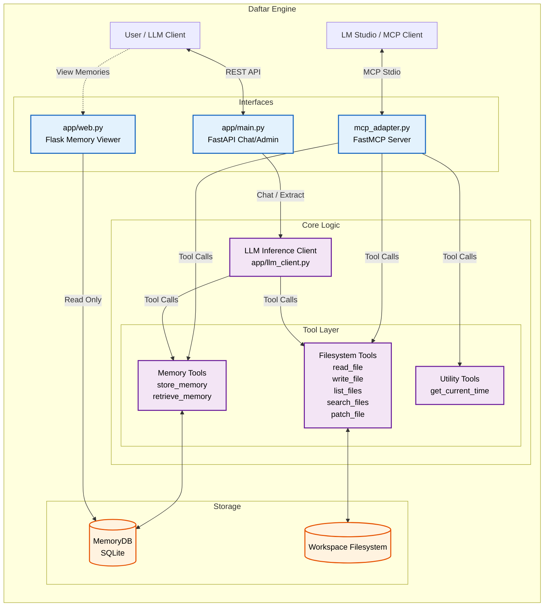
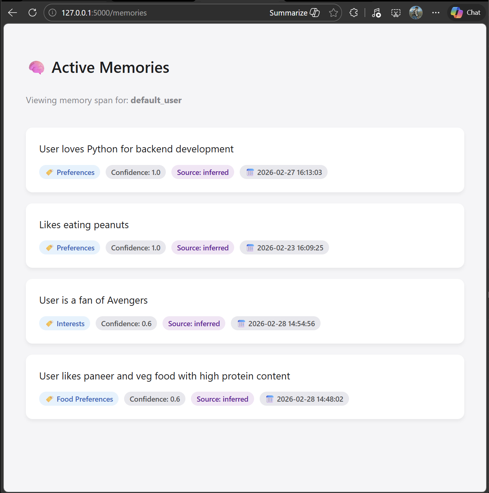
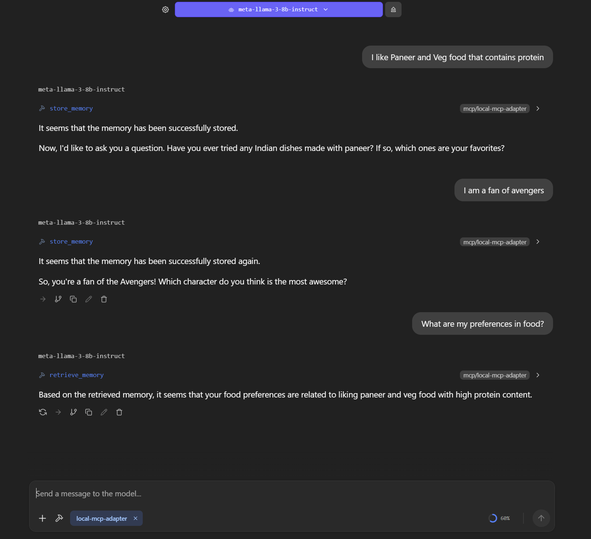

#  Daftar : The Intelligent Memory Engine & MCP Server


**Daftar** (meaning *Office* or *Register*) is a production-grade **Local AI Context & Tool Engine** built around the Model Context Protocol (MCP).

It acts as the persistent operational layer for Large Language Models, providing structured memory, filesystem access, and controlled tool execution so local AI systems can maintain context, manipulate files, and safely interact with long-running environments.

Instead of being just a memory store, **Daftar functions as a lightweight agent runtime** — enabling LLMs to persist knowledge, retrieve relevant information, and interact with their workspace through a secure, extensible tool layer.

Built with concurrency-safe SQLite storage, hardened filesystem policies, and a seamless FastMCP adapter, Daftar is designed to serve as the **long-term contextual brain and tool interface for local AI applications** such as LM Studio, local assistants, and autonomous agent systems.

---

## ✨ Key Features

- **🧠 Persistent Context Memory**  
  Store and retrieve long-term user context using `store_memory` and `retrieve_memory`.

- **📂 Workspace File System Tools**  
  Allow models to interact with project files through secure MCP tools such as:
  - `read_file`
  - `write_file`
  - `list_files`
  - `search_files`
  - `patch_file`

- **🔌 Model Context Protocol (MCP)**  
  Native support for the MCP standard, making Daftar instantly compatible with clients like **LM Studio** and other MCP-enabled AI environments.

- **🧰 Extensible Tool Layer**  
  Provides a structured interface for AI tools including filesystem access, memory storage, and utility functions like `get_current_time`.

- **🔒 Multi-Tenant & Secure**  
  Strict `user_id` separation and attribute-based access control across memory subjects (e.g., Work, Health, Preferences).

- **🕸️ Independent Web UI**  
  A lightweight Flask application providing a **read-only memory viewer** for inspecting stored memories.

- **⚡ FastAPI Assistant Backend**  
  A scalable API layer for chat inference, admin control, and external integrations.

- **🛡️ Hardened Filesystem & Access Policies**  
  Secure path resolution prevents directory traversal and ensures LLMs can only operate inside the designated workspace.

- **⚙️ Local Agent Runtime**  
  Designed to act as the **tool execution layer for local AI assistants**, enabling them to reason, act, and persist context across sessions.


## 🏛️ Architecture & Data Flow


```mermaid
graph TD
    Client["User / LLM Client"]
    LMStudio["LM Studio / MCP Client"]
    
    subgraph Daftar Engine
        direction TB
        
        subgraph Interfaces
            MCP_Adapter["mcp_adapter.py<br/>FastMCP Server"]
            FastAPI["app/main.py<br/>FastAPI Chat/Admin"]
            WebUI["app/web.py<br/>Flask Memory Viewer"]
        end
        
        subgraph Core Logic
            LLMClient["LLM Inference Client<br/>app/llm_client.py"]
            
            subgraph Tool Layer
                FileTools["Filesystem Tools<br/>read_file<br/>write_file<br/>list_files<br/>search_files<br/>patch_file"]
                MemoryTools["Memory Tools<br/>store_memory<br/>retrieve_memory"]
                UtilityTools["Utility Tools<br/>get_current_time"]
            end
        end
        
        subgraph Storage
            DB[("MemoryDB<br/>SQLite")]
            Workspace[("Workspace Filesystem")]
        end
        
        %% Flow connections
        LMStudio <-->|MCP Stdio| MCP_Adapter
        Client <-->|REST API| FastAPI
        Client -.->|View Memories| WebUI
        
        MCP_Adapter -->|Tool Calls| FileTools
        MCP_Adapter -->|Tool Calls| MemoryTools
        MCP_Adapter -->|Tool Calls| UtilityTools
        
        FastAPI -->|Chat / Extract| LLMClient
        LLMClient -->|Tool Calls| FileTools
        LLMClient -->|Tool Calls| MemoryTools
        
        FileTools <--> Workspace
        MemoryTools <--> DB
        
        WebUI -->|Read Only| DB
    end

    classDef interface fill:#e3f2fd,stroke:#1565c0,stroke-width:2px,color:#000;
    classDef logic fill:#f3e5f5,stroke:#6a1b9a,stroke-width:2px,color:#000;
    classDef storage fill:#fff3e0,stroke:#e65100,stroke-width:2px,color:#000;

    class MCP_Adapter,FastAPI,WebUI interface;
    class LLMClient,FileTools,MemoryTools,UtilityTools logic;
    class DB,Workspace storage;

```

---

## 🚀 Installation

### Prerequisites
- Python 3.11 or higher
- Git

### Steps
1. **Clone the repository:**
   ```bash
   git clone https://github.com/NeelakshSaxena/Daftar.git
   cd Daftar
   ```

2. **Create and activate a virtual environment:**
   ```bash
   # On macOS/Linux
   python3 -m venv venv
   source venv/bin/activate

   # On Windows
   python -m venv venv
   .\venv\Scripts\activate
   ```

3. **Install dependencies:**
   ```bash
   pip install -r requirements.txt
   ```

---

## 💻 Usage & Deployment

Daftar consists of several modular components that can be run independently based on your use case.

### 1. Running the Flask Web UI (Memory Viewer)
The read-only UI provides a ground-truth view of active memories isolated by user.
```bash
python app/web.py
```
*Access the UI in your browser at: `http://localhost:5000/memories?user_id=default_user`*



### 2. Running via Docker
Daftar provides a Dockerfile for easy, containerized deployment. By default, the container spins up the Flask Web UI.
```bash
docker build -t daftar-memory-engine .
docker run -p 5000:5000 daftar-memory-engine
```

### 3. Running the FastAPI Engine
If you are integrating Daftar via REST API instead of MCP:
```bash
uvicorn app.main:app --host 0.0.0.0 --port 8000
```
*Access the interactive API documentation at `http://localhost:8000/docs`.*

---

## 🔗 Integrating with LM Studio (MCP)

To connect Daftar to LM Studio as a localized custom tool provider, you will utilize the Model Context Protocol.

1. Locate the `mcp.json` file in the root directory.
2. Ensure the paths for `"command"` and `"args"` point to your absolute local paths. 
   *(Example for Windows)*:
   ```json
   {
     "mcpServers": {
       "Local MCP Adapter": {
         "command": "C:\\absolute\\path\\to\\Daftar\\venv\\Scripts\\python.exe",
         "args": [
           "C:\\absolute\\path\\to\\Daftar\\mcp_adapter.py"
         ],
         "env": {}
       }
     }
   }
   ```
3. Add the server configuration to LM Studio's MCP Settings.
4. Restart LM Studio. The tools (`store_memory`, `retrieve_memory`, `read_file`, `ping`, `get_current_time`) will automatically populate and be available for the LLM during generation.



---

## 🧪 Testing

Daftar is heavily tested against race conditions, path traversal attacks, and strict payload contracts. 
To run the automated test suite:

```bash
# Ensure you are at the project root
python scripts/test_all.py
```

Other specific stress tests are available in the `scripts/` directory:
- `python scripts/stress_test.py` (Database lock and concurrency testing)
- `python scripts/test_path_attacks.py` (Security hardening checks)

---

## � Releases

You can find the latest stable versions of Daftar in the [Releases](https://github.com/NeelakshSaxena/Daftar/releases) section of this repository.

Each release includes:
- **Source Code**: ZIP and TAR.GZ archives of the codebase.
- **Changelog**: Detailed notes on new features, bug fixes, and improvements.

To get started with a specific release, simply download the source code from the latest release page and follow the Installation instructions.

---

## �📜 License
*Daftar is strictly maintained as an internal project.*


